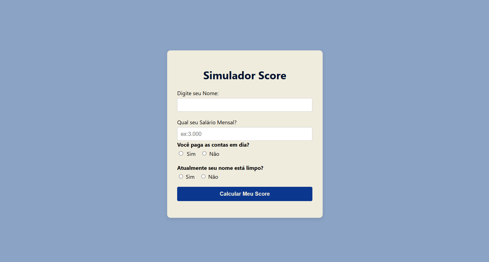

# CreditScore-API | Simulador de Análise de Risco e Crédito (C#)

Este é um projeto básico de simulação de motor de crédito, desenvolvido em **C#** utilizando o **.NET**. O objetivo é demonstrar a aplicação prática de regras de negócio financeiras para análise de perfil e cálculo de score de risco de crédito de clientes.

## Funcionalidades
1.Coleta de dados básicos (Renda, histórico de negativação e hábitos de pagamento).
**Motor de Regras Simples**: 
Algoritmo que calcula a pontuação (Score) de 0 a 1000 com base em penalidades de risco.
**Classificação de Risco**:
Divide o cliente em faixas de risco (Baixo, Médio e Alto) inspiradas nos modelos de mercado.
**Alinhamento com LGPD**:
A aplicaçõ não registra nenhum dado sensível, é uma simulação simples.
## Como Executar
1. Instale o .NET SDK em sua máquina.
2. Clone este repositório.
3. No terminal, execute o comando:
   ```bash
   dotnet run
4.
   
   


